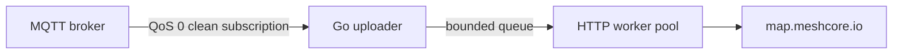

# Internal architecture

The uploader maintains its own MQTT connection and reconnects when that connection is lost.

`internal/mqtt` uses Eclipse Paho's Go MQTT client. Its callback only attempts a nonblocking send to a bounded intake channel. `internal/uploader` applies the required IATA allowlist before updating any state, then owns the 24-hour observer status cache, one-minute MeshCore packet-ID deduplication map, 72-hour per-node handled timestamp map with a one-hour minimum advance for new adverts, and bounded job channel. A configurable HTTP worker pool handles signing, timeouts, and retries. When intake or upload capacity is exhausted, work is dropped and logged. State is process-local and resets on restart. Repeated adverts provide another chance to upload.

The packet decoder validates the MeshCore header, path length, advert length, and Ed25519 signature before a map request is created. It implements the ADVERT subset needed here.

An optional decoder parity test is available with `MESHCORE_JS_MODULE=/absolute/path/to/meshcore.js-entry.mjs go test -tags jscompare ./internal/uploader`.

Normal operation writes no application data to disk. A one-time `keygen` command creates a 0600 signing seed; a MeshCore expanded private key can also be supplied. The chosen secret must be backed up and mounted read-only for the running service. Container or host logging may still use disk, depending on deployment configuration.
